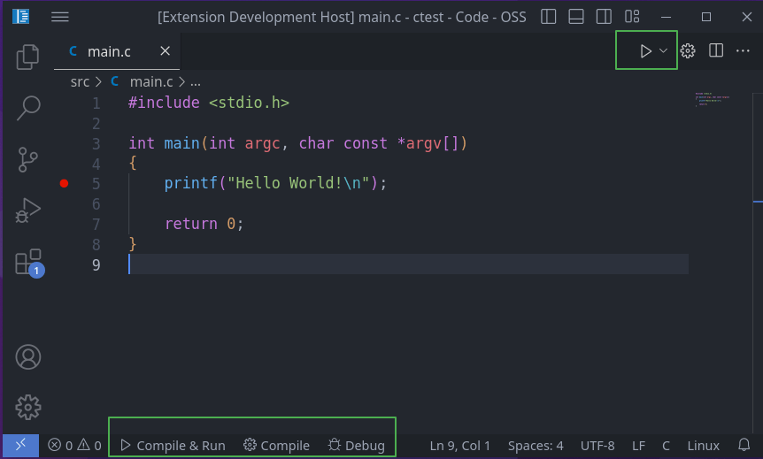

# C/C++ Compile Run Extension

<a href="https://www.buymeacoffee.com/danielpinto8zz6" target="_blank"></a>
[](https://www.paypal.me/danielpinto8zz6/)

[](https://marketplace.visualstudio.com/items?itemName=danielpinto8zz6.c-cpp-compile-run)
[](https://marketplace.visualstudio.com/items?itemName=danielpinto8zz6.c-cpp-compile-run)
[](https://marketplace.visualstudio.com/items?itemName=danielpinto8zz6.c-cpp-compile-run&ssr=false#review-details)
[](https://open-vsx.org/extension/danielpinto8zz6/c-cpp-compile-run)
[](https://open-vsx.org/extension/danielpinto8zz6/c-cpp-compile-run)
[](https://open-vsx.org/extension/danielpinto8zz6/c-cpp-compile-run/reviews)

A Visual Studio Code extension to **compile, run, and debug** single C/C++ files easily.



## Features

- Compile, run, and debug C/C++ files directly from the command palette, status bar, or menu icons.
- Quick access via keybindings: `F6`, `F7`, `F5`, and more.
- Supports custom compiler paths, flags, and run arguments.
- Option to run in an external terminal.

## Requirements

- **Linux:** Install `gcc` ([setup instructions](docs/COMPILER_SETUP.md#Linux))
- **Windows:** Install `tdm-gcc` ([setup instructions](docs/COMPILER_SETUP.md#Windows))
- **macOS:** Install `clang` or `gcc` ([setup instructions](docs/COMPILER_SETUP.md#MacOS))

## Getting Started

1. Open a `.c` or `.cpp` file in VS Code.
2. Press **F6** to compile and run the file with default settings.
3. Press **F7** to specify custom arguments before running.
4. Press **F5** to debug (includes compilation).
5. Use the status bar or menu icons for quick access.

> **Tip:** You can configure compiler paths, flags, and other options in the extension settings. Enable "Save Before Compile" to automatically save files before building.

## Configuration

| Key                                         | Description                                                             |
| ------------------------------------------- | ----------------------------------------------------------------------- |
| c-cpp-compile-run.c-compiler                | The C compiler path (e.g. `/usr/bin/gcc` or `C:\TDM-GCC-64\bin\gcc.exe`)|
| c-cpp-compile-run.cpp-compiler              | The C++ compiler path (e.g. `/usr/bin/g++` or `C:\TDM-GCC-64\bin\g++.exe`)|
| c-cpp-compile-run.save-before-compile       | Save the file before compiling                                          |
| c-cpp-compile-run.c-flags                   | C compiler flags (default: `-Wall -Wextra -g3`)                         |
| c-cpp-compile-run.c-linker-flags            | C linker flags (e.g. `-lm`)                                             |
| c-cpp-compile-run.cpp-flags                 | C++ compiler flags (default: `-Wall -Wextra -g3`)                       |
| c-cpp-compile-run.cpp-linker-flags          | C++ linker flags (e.g. `-lm`)                                           |
| c-cpp-compile-run.run-args                  | Program arguments when running                                          |
| c-cpp-compile-run.run-in-external-terminal  | Run in an external terminal                                             |
| c-cpp-compile-run.should-show-notifications | Show notifications                                                      |
| c-cpp-compile-run.output-location           | Custom output location for the compiled file. Supports `${workspaceFolder}` and `${pwd}` variables. See [Output Folder Mirroring](#output-folder-mirroring) |
| c-cpp-compile-run.custom-run-prefix         | Prefix command before run (e.g. `valgrind ./foobar`)                    |
| c-cpp-compile-run.additional-include-paths | Additional directories to add to the compiler's include path (e.g. ["${workspaceFolder}/include"]) |

## Output Folder Mirroring

You can configure the extension to mirror your source folder structure in a separate output directory.  
For example, if your project is organized as:

```
myproj/
├── src/
│   ├── basics/
│   │   └── HelloWorld.cpp
│   └── functions/
│       └── Math.cpp
└── out/
```

And you set in your `.vscode/settings.json`:

```json
{
    "c-cpp-compile-run.output-location": "${workspaceFolder}/out"
}
```

When you compile `src/basics/HelloWorld.cpp`, the executable will be placed at:

```
out/basics/HelloWorld.exe
```

The subfolder structure under `src` is mirrored under `out`, so both source and output files stay in the same relative location.

- `${workspaceFolder}` will be replaced with your project's root folder.
- `${pwd}` will be replaced with your current working directory.

**Example:**  
If your file is `D:/myproj/src/functions/Math.cpp`,  
the output will be `D:/myproj/out/functions/Math.exe`.

This makes it easy to keep your build artifacts organized and separate from your source code, similar to Gradle/Java project layouts.

## Keybindings

| Linux  | Windows | Mac   | Description                                                     |
| ------ | ------- | ----- | --------------------------------------------------------------- |
| F6     | F6      | Cmd+R | Compile and run the file                                        |
| Ctrl+6 | Ctrl+6  | Cmd+6 | Compile and run the file                                        |
| F8     | F8      | Cmd+Y | Compile and run the file in an external console                 |
| F7     | F7      | Cmd+T | Compile and run the file with custom arguments and flags         |
| F5     | F5      | Cmd+5 | Debug the file (includes compile)                               |

## Release Notes

See the [CHANGELOG](CHANGELOG.md) for details.